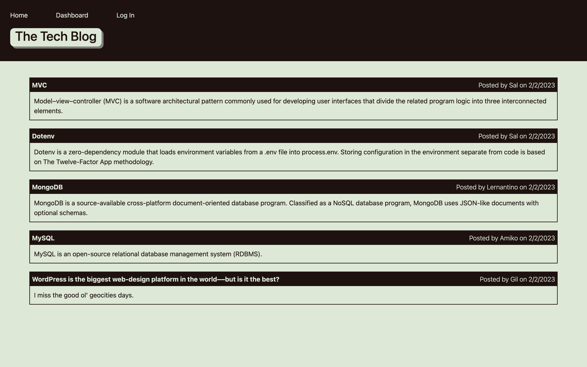

# Tech Blog

## Description

A WordPress style tech blog where users can write and pulish posts, and leave comments beneath those posts.

## Table of Contents

- [Deployed Site](#deployed-site)
- [Installation](#installation)
- [Usage](#usage)
- [Image](#image)
- [Credits](#credits)
- [License](#license)
- [Testing](#testing)
- [Questions](#questions)

## Deployed Site

[https://gy-tech-blog.herokuapp.com/](https://gy-tech-blog.herokuapp.com/)

## Installation

Clone the github repository with 'git clone https://github.com/aphexgil/tech-blog.git', navigate into the newly-cloned directory with 'cd tech-blog' and  initialize node packages with 'npm i'.  Seed the database by running 'node seeds/seed.js', and finally  get the server going by running 'node server.js'.

## Usage

Open the home page from your preferred browser at 'localhost:3001'. From the home page, the user should naigate to the 'Log In' page, where they can long into their account or, if they don't haven an account, sign up for a new one. Once logged in, the user can navigate to individual blogs from the home page, where they can read the full post, view other users comments under that post, and add their own comments. From the 'Dashboard' page, users can see all their past posts, which can be edited or deleted, or they can write a new post.

## Image

## Credits

None

## License

  This software is covered under MIT License. To find out more, visit [MIT License](https://opensource.org/licenses/MIT)

## Testing

No tests provided at this time

## Questions

If you have any questions, direct them to https://github.com/aphexgil or gil.young.1994@gmail.com.
